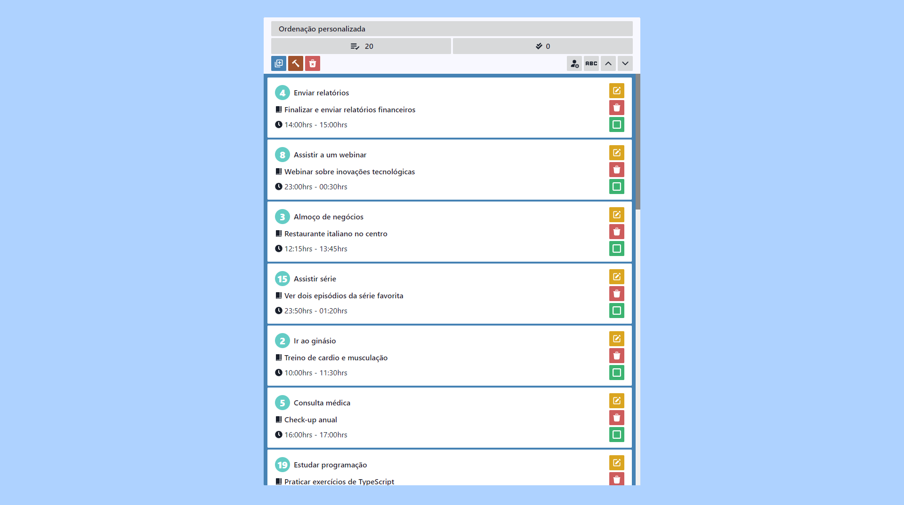
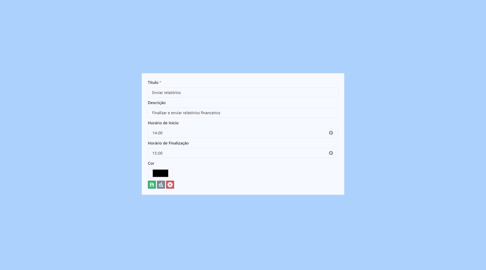
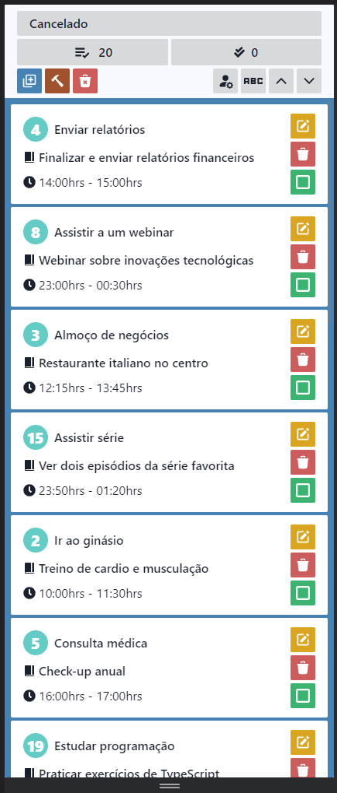

# 🗓️ Agenda de Tarefas

Uma aplicação construída em **React**, **TypeScript** e **Vite** para a organização de tarefas. Ela foi desenvolvida com o objetivo principal de servir como material de estudo.

## 🚀 Principais Tecnologias Utilizadas

- **React**: Uma biblioteca JavaScript para construir interfaces de usuário.
- **TypeScript**: Superset de JavaScript que adiciona tipagem estática.
- **Vite**: Ferramenta de build que visa proporcionar um desenvolvimento mais rápido.

## 🎯 Objetivo

O foco deste projeto foi mergulhar nas tecnologias modernas de desenvolvimento front-end. Está aplicação foi desenvolvida com finalidade apenas e exclusiva de estudo.

